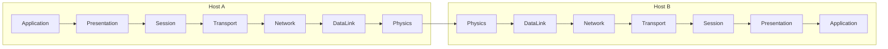

# ネットワークの基礎

## プロトコル！
プロトコルとは一体何でしょうか？我々が普段の生活においてほとんど耳にすることはありません。しかし、コンピューターネットワークを支える非常に重要な概念です。

プロトコルとは、コンピュータとコンピュータが情報を交換する際の「約束ごと」です。データをどんな形式で表現するのか？データをどんな手順でやりとりするのか？といったことが決められています。
もちろん、「約束ごと」ですから、お互いにそのプロトコルについて知っていて初めて通信ができるようになります。

我々が普段使うような代表的なプロトコルはHTTPやSMTP、TCP、UDP、IP、DNS、Ethernet、IEEE 802.11(無線LAN）などがあります。その他にもARPやICMP、IPSec、NTP、FTP、DHCPといったプロトコルが存在します。
上であげたプロトコルたちは、TCP/IPというネットワークアーキテクチャに属するプロトコルたちで、他のOSIやAppleTalkといったネットワークアーキテクチャにもそれぞれプロトコルが存在します。

- 上記のプロトコルの正式名称

| 略称 　     | 正式名称                                |
|----------|-------------------------------------|
| HTTP     | Hyper Text Transfer Protocol        |
| SMTP     | Simple Mail TransferProtocol        |
| TCP      | Transmission Control Protocol       |
| UDP      | User Datagram Protocol              |
| IP       | Internet Protocol                   |
| DNS      | Domain Name System                  |
| ARP      | Address Resolution Protocol         |
| ICMP     | Internet Control Message Protocol   |
| IPSec    | IP Security Protocol                |
| NTP      | Network Time Protocol               |
| FTP      | File Transfer Protocol              |
| DHCP     | Dynamic Host Configuration Protocol |

## OSI参照モデル
前の章でたくさん出てきたプロトコルですが、これらは役割ごとに大きく７つの階層に分けることができます。

| レイヤ        | プロトコル                      |
|------------|----------------------------|
| アプリケーション層  | HTTP SMTP DNS NTP DHCP FTP |
| プレゼンテーション層 |                            |
| セッション層     |                            |
| トランスポート層   | TCP UDP IPSec              |
| ネットワーク層    | IP ICMP                    |
| データリンク層    | ARP Ethernet IEEE802.11    |
| 物理層        |                            |
この階層構造をOSI参照モデルと呼びます。実際に広く利用されているTCP/IPモデルとは異なっているのですがプロトコルの役割を説明するのに便利なのでよく使われています。

OSI参照モデルには７つの層が存在し、より上位のプロトコルが下位のプロトコルを利用する形になっています。

HTTPを利用して通信を行う際の各層の働きを図にすると次のようになります。
